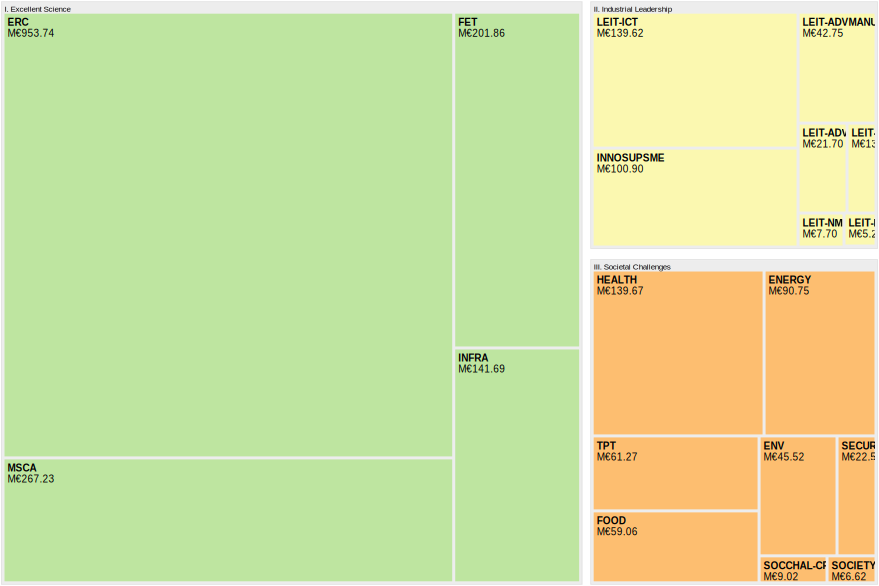

<!-- README.md is generated from README.Rmd. Please edit that file -->

```{r, include = FALSE}
library(magrittr)
knitr::opts_chunk$set(
  collapse = TRUE,
  comment = "#>"
)
```

# Swiss Participation

<!-- badges: start -->
<!-- badges: end -->

[**R notebook**](Rmd/swiss-participation.Rmd) summarizing participation statistics of Switzerland in EU-Framework programmes in research and development.

## Data

- [CORDIS](https://data.europa.eu/data/datasets/cordish2020projects?locale=en), updated 2021-12-14
- [**Horizon 2020 Dashboard**](https://webgate.ec.europa.eu/dashboard) `>` `H2020 Projects` > `Data Export` (`Raw Data Export Sheet`), updated 2021-12-06

## Results

> Overall H2020 EU contribution (MEUR) to Switzerland by Pillar and Thematic Priority



> H2020 EU contribution (MEUR) to Switzerland by Pillar, Thematic Priority, and Entity Type: HighEd (Higher or secondary education), ResOrg (Research organisations), PubOrg (Public body), Private (Private for profit)

```{r, echo=FALSE, message=FALSE}
readr::read_csv("data/h2020-org-type.csv") %>%
  knitr::kable()
```


> H2020 EU contribution (MEUR) to Switzerland in Pillar I by call year

```{r, echo=FALSE, message=FALSE}
readr::read_csv("data/h2020-pillar1.csv") %>%
  knitr::kable()
```

## More

- [SERI website](https://www.sbfi.admin.ch/sbfi/en/home/research-and-innovation/international-cooperation-r-and-i/eu-framework-programmes-for-research/horizon-2020/ch-status-horizon-2020.html)
