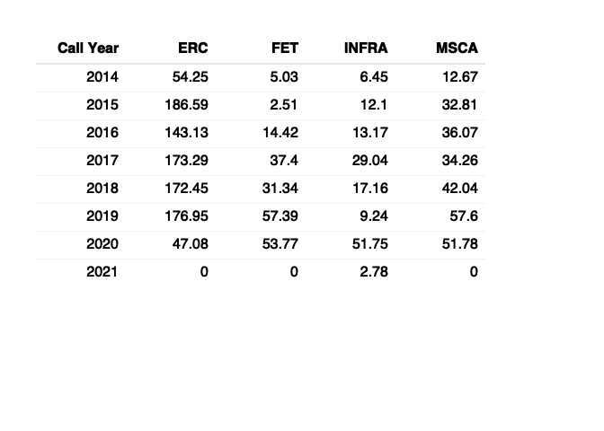

<!-- README.md is generated from README.Rmd. Please edit that file -->

# Swiss Participation

<!-- badges: start -->
<!-- badges: end -->

[**R notebook**](Rmd/swiss-participation.Rmd) summarizing participation
statistics of Switzerland in EU-Framework programmes in research and
development.

## Data

-   [CORDIS](https://data.europa.eu/data/datasets/cordish2020projects?locale=en),
    updated 2021-12-14
-   [**Horizon 2020 Dashboard**](https://webgate.ec.europa.eu/dashboard)
    `>` `H2020 Projects` &gt; `Data Export` (`Raw Data Export Sheet`),
    updated 2021-12-06

## Results

### H2020 EU contribution (MEUR) to Switzerland

### H2020 EU contribution (MEUR) to Switzerland in Pillar I

<!-- -->

## More

-   [SERI website on the
    topic](https://www.sbfi.admin.ch/sbfi/en/home/research-and-innovation/international-cooperation-r-and-i/eu-framework-programmes-for-research/horizon-2020/ch-status-horizon-2020.html)
